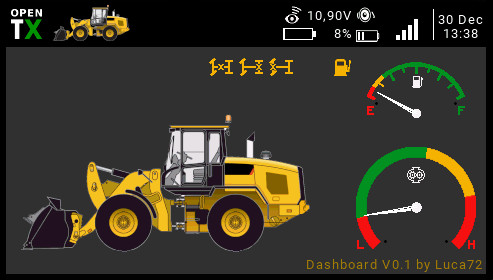

# LUA-MchDash

LUA widget for Horus/Tx16s, etc to display dashboard for construction machinery

Copy the MchDash folder on SD card inside the Widget folder.

Before use personalize the widget editing the main.lua file:

--- ############################ CONFIGURATION ##############################

-- WIDGET NAME
local widgetName = "MchDash"

-- CONFIGURATION
local MODE_SWITCH_PRES = true

local CENT_LOCK_PRES = false

local REAR_LOCK_PRES = false

local FRONT_LOCK_PRES = false

-- SWITCHES
local SW_MODE = 'se'        -- -100% = main_A pic | 0% = main_B pic | 100% = main_C pic

local SW_CENT_LOCK = 'sd'   -- -100% = no lock | >= 0% = lock

local SW_AXLES_LOCK = 'sa'  -- -100% = no lock | 0% = rear lock | 100% = front lock

-- CHANNELS
local OUT_PUMP = 'ch3'      pump output channel

--- #########################################################################

widgetName: must be the same of the Widget folder name (you can change it at your pleasure)

MODE_SWITCH_PRES: set true if you use a swith to activate different parts of your model (see PICTURES)

CENT_LOCK_PRES: set true if you have center difflock

REAR_LOCK_PRES: set true if you have rear difflock

FRONT_LOCK_PRES: set true if you have front difflock

SW_MODE: set your mode switch (if you have one). default: 'se'.  values: -100% = main_A pic | 0% = main_B pic | 100% = main_C pic

SW_CENT_LOCK: set your central difflock switch (if you have one). default: 'sd', values: -100% = no lock | >= 0% = lock

SW_AXLES_LOCK: set your axles difflock switch (if you have one). default: 'sa', values: -100% = no lock | 0% = rear lock | 100% = front lock

OUT_PUMP: set your oil pump channel. default: 'ch3'

PICTURES:

You have to provide one or more PNG images for your model. Their size must be 316x200

main_A.png is the main image and it must always exists.

main_B.png and main_C.png are used in combination with MODE_SWITCH_PRES=true and SW_MODE (-100% = main_A pic | 0% = main_B pic | 100% = main_C pic). 

